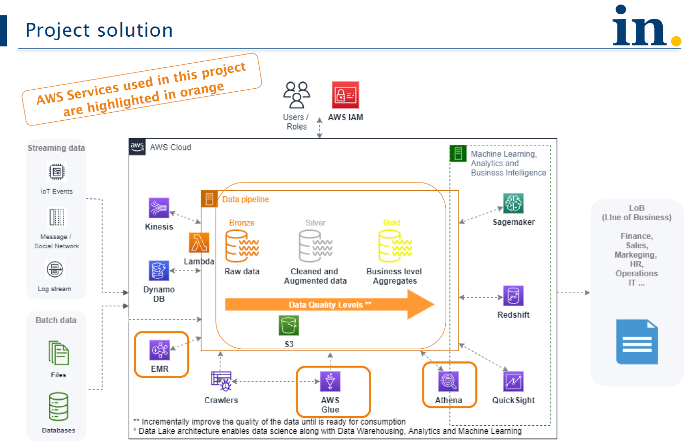
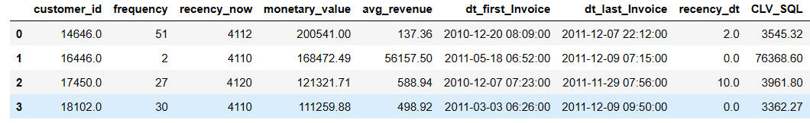
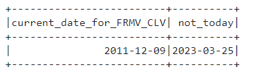
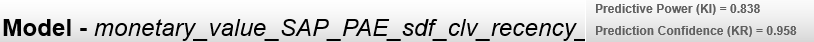
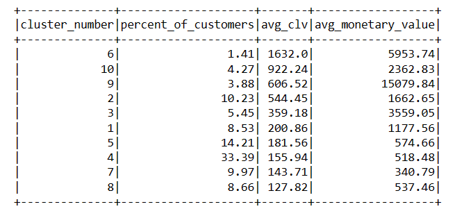
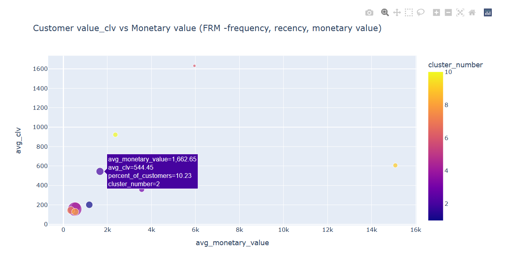
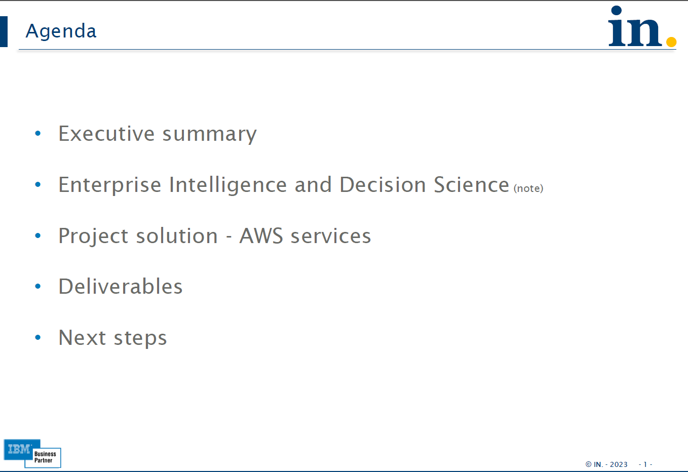
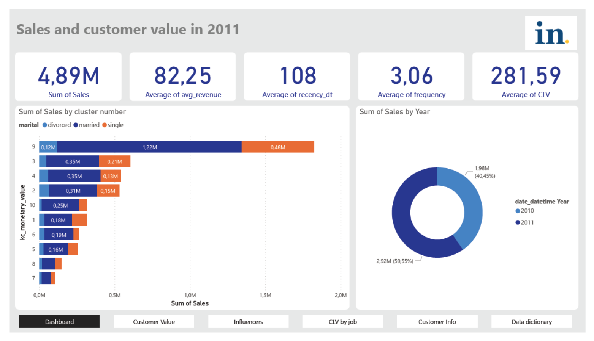

## Customer Value

<b> CLV stands for "Customer Lifetime Value".</b> It refers to the amount of money that a customer is expected to spend on a company's products or services over the entire duration of their relationship with the company.

Calculating the CLV of a customer is important because it helps companies understand the long-term value of each customer and make decisions about how much they are willing to spend to acquire and retain customers. By understanding the CLV, companies can also prioritize their resources towards acquiring and retaining high-value customers, and develop strategies to improve customer loyalty and retention.

CLV (Customer Lifetime Value) is a metric used to estimate the total value a customer will bring to a business over their entire lifetime. In this example, it is calculated by multiplying the average value of a purchase, the number of purchases made per year, and the average length of the customer relationship. CLV helps businesses determine how much they should invest in acquiring and retaining customers.

FRM (Frequency, Recency, and Monetary Value) is a method used to segment customers based on their purchase behavior. It is a commonly used approach in marketing, sales and customer analytics. Here's how it works:

Frequency: This represents how often a customer makes a purchase. Customers who make frequent purchases are more valuable to a business than those who make infrequent purchases.

Recency: This represents how recently a customer has made a purchase. Customers who have made a purchase more recently are more likely to make another purchase than those who have not made a purchase in a long time.

Monetary Value: This represents how much a customer spends on each purchase. Customers who spend more per purchase are more valuable to a business than those who spend less.

Using these three factors (FRM), businesses can segment their customers into groups based on their purchase behavior. For example, customers who make frequent purchases, have made a purchase recently, and spend a lot per purchase would be considered high-value customers.

#### AWS Architecture

<b> Here's an example of how to implement Customer value using FRM with Spark-PySpark and customer purchase history </b> 
[Click here to open EMR serverless_python_script](./bin/emr_serverless_execution_customer_value_v2.py)

- Spark could run this solution with millions of customers and billions of revenue transactions, for companies such as Amazon, Wall Wart and Alibaba without code change

The output of PySpark code will be the CLV for each customer ID. Note that the CLV calculation is based on the assumptions and simplifications made in the code, so the results should be taken as estimates and not definitive values.

Note that this is a simple example and there are many other factors that can affect CLV, such as customer acquisition cost, customer retention rate, and discount rates. This example should be considered as a starting point and further analysis may be required to accurately estimate CLV. <b> One more complex solution to calculate Customer Lifetime Value (CLV) based on present value (PV), future value (FV), and customer lifetime is a more advanced approach </b> to estimating CLV. The formula for this approach is as follows:

CLV = [ (average revenue per customer * customer lifetime) - customer acquisition cost ] / (1 + discount rate - retention rate)

Where:

- Average revenue per customer: the average amount of revenue generated by a customer per purchase
- Customer lifetime: the expected time that a customer will remain active and continue to make purchases
- Customer acquisition cost: the cost associated with acquiring a new customer
- Discount rate: the rate used to discount future cash flows to their present value
- Retention rate: the percentage of customers that continue to make purchases over a given time period

To calculate CLV using this formula, you will need to estimate the inputs for each variable based on your business and customer data. 

Let´s come back to CLV using FRM (Frequency, Recency, and Monetary Value) to present the solution

- CLV formula : (monetary_value / frequency) * (1 - ((recency_dt + 1) / 365)) / (1 + discount_rate = 0.1 = 10%) )

Note: The recency_now column show execution on 2023-03-25. The execution to calculate CLV use recency_dt that is 2011-12-09 (latest invoice date). 
- Detailed source code at bin/ directory

After all process executed the results are

### CLV by Customer

### Machine Learning model
<b> Machine Learning model to build clusters of customers associated with the FRM solution </b> can also provide insights for sales and marketing optimizations campaigns. 
- ML model with prediction confidence of 95.8%

###### Percent distribution, CLV vs Monetary Value

### Agenda em project solution
- Click here to open the [Project Solution](./doc/Customer_value_demo_AWS_architecture__project_solution.pdf) doc

#### Customer value Dashboard and reports
- Click here to open one example of [Customer value dashboard and report](./doc/Customer_value_demo_Dashboard_and_Report.pdf)

###### Notes
- All code and documents are available under bin/, HTML viewer and doc/ directories 
- bin/ directory also have code with examples using Athena Spark Job and local execution
