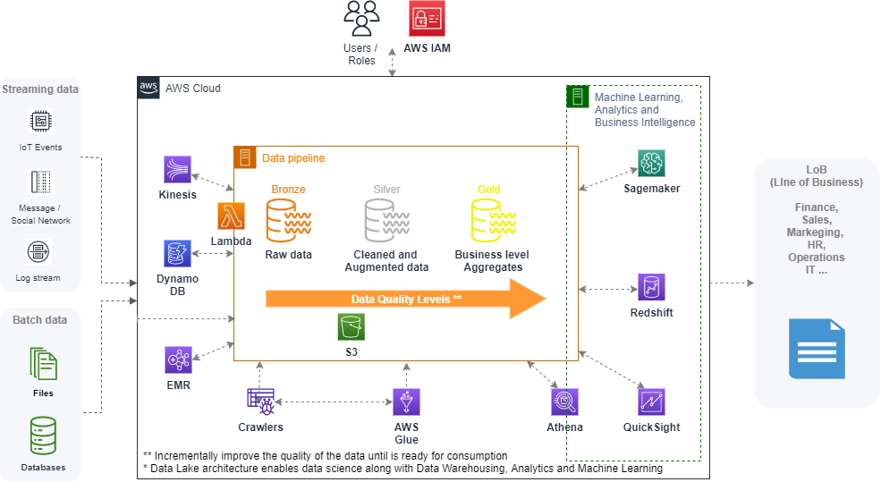

# AWS_architecture__BigData

### Introduction

The evolution of <b> decision support systems (DSS) </b>  has been largely shaped by advancements in technology and the growing need to process vast amounts of data quickly and efficiently. Store, manage and process <b>Big Data</b>. Among the most significant advancements that have enabled this evolution are massively parallel processing (MPPs) and data lakes. These technologies have facilitated the development of DSS that are more powerful and effective than ever before, allowing businesses to harness the power of big data to drive their decision-making processes. As a result, the concept of <b> Enterprise Intelligence </b> has emerged, which refers to the comprehensive use of data and analytics to gain insights that can inform strategic decision-making across an organization.

- <b>MPPs</b> involve dividing large data sets into smaller pieces and processing them simultaneously across multiple processors or nodes, allowing for faster data processing and analysis. This technology allows for complex queries, processess and analytics to be performed on vast amounts of data.
 

- <b>Data lakes</b>, on the other hand, are large repositories of raw data that are stored in their native format, filtered, cleaned and augmented data with business-level aggregates data also, making it easier to access and analyze. Data lakes are used to store both structured and unstructured data, making it an ideal storage solution for big data applications.

All the pieces together, these advancements enable the organizations and relevant stakeholders to respond rapidly to changing market conditions and make data-driven, informed decisions.

### AWS Architecture example to process Big Data

- Some notes of AWS tools and services

#### AWS S3 (Simple Storage Service)
AWS S3 (Simple Storage Service) is a scalable, secure, and durable object storage service that can be used as a data lake to store and retrieve large volumes of data. In a decision support system architecture, AWS S3 is often used as a central storage repository for raw data, which can then be accessed and analyzed by other services such as EMR, Athena, or Redshift.

Here's how AWS S3 fits into a typical big data architecture:

Data ingestion: Raw data is ingested from various sources such as sensors, logs, or databases and stored in S3 buckets.

Data transformation: Data is transformed and processed using services like EMR, which can run big data frameworks like Spark, Hive, or Presto on the data stored in S3 buckets.

Data warehousing: Processed data can be moved to Redshift, an MPP data warehousing solution, for storage and analysis.

Data exploration and analytics: SQL-based analytics can be performed on data stored in S3 buckets using Athena, a serverless, interactive query service.

Data visualization and reporting: The results of the data analysis can be visualized and reported using business intelligence tools such as Tableau, Power BI, or QuickSight.

Overall, AWS S3 provides a scalable, durable, and secure storage solution that can be integrated with other AWS services to build a complete decision support system architecture that can process, analyze, and report on large volumes of data in real-time.

#### AWS Kinesis and DynamoDB
- <b> AWS Kinesis and DynamoDB  </b> are two different AWS services that can be used together in a decision support system architecture to enable real-time data processing and analytics.

- AWS Kinesis is a fully managed streaming data service that enables real-time processing of large data streams such as logs, social media feeds, clickstreams, and IoT telemetry data. Kinesis can be used to ingest and process data in real-time and make it immediately available for further analysis using other AWS services like Lambda, EMR, or Redshift. Kinesis also supports multiple consumers, allowing real-time data to be processed simultaneously by multiple applications.

- DynamoDB is a fast, flexible, and fully managed NoSQL database service that provides single-digit millisecond latency at any scale. DynamoDB is designed to handle large volumes of data and traffic and provides a flexible data model that can handle both structured and unstructured data. DynamoDB supports document and key-value data models and can be used to store and retrieve data at low latency with automatic scaling.

Together, Kinesis and DynamoDB can be used to build real-time data processing pipelines that can handle large volumes of data with low latency. For example, Kinesis can be used to ingest and process real-time data streams, which can then be stored in DynamoDB for further analysis and reporting. DynamoDB can also be used as a cache for frequently accessed data, enabling faster access and reducing the need for expensive database queries.

In summary, AWS Kinesis and DynamoDB are two powerful services that can be used together in a decision support system architecture to enable real-time data processing and analysis. Kinesis provides the ability to ingest and process large volumes of streaming data in real-time, while DynamoDB provides a fast and flexible NoSQL database service for storing and retrieving the processed data.

#### AWS Lambda
AWS Lambda is a serverless compute service provided by AWS that enables you to run your code without provisioning or managing servers. With Lambda, you can simply upload your code as a function and AWS Lambda will automatically run and scale your code based on incoming requests or events. This approach can help you reduce operational overheads, increase agility, and enable you to focus on writing code instead of managing infrastructure.

Here are some of the key features and benefits of AWS Lambda:

Pay-per-use model: With AWS Lambda, you only pay for the compute time that your code actually consumes, measured in increments of 100 milliseconds. There are no upfront costs or minimum fees, and you don't need to manage or pay for any servers.

Auto-scaling: AWS Lambda automatically scales your code in response to incoming requests or events. This means that you don't need to worry about provisioning or managing servers, and you can handle any amount of traffic or workload with ease.

Flexible programming languages: AWS Lambda supports a variety of programming languages including Node.js, Python, Java, C#, and Go, allowing you to write your functions in your preferred language.

Event-driven computing: AWS Lambda can be triggered by a variety of events such as changes to an S3 bucket, updates to a DynamoDB table, or a message from an Amazon SNS topic. This makes it easy to build event-driven applications or serverless workflows.

Easy integration with other AWS services: AWS Lambda can be easily integrated with other AWS services such as API Gateway, S3, DynamoDB, Kinesis, and more. This enables you to build powerful and scalable applications using a variety of AWS services.

Overall, AWS Lambda provides a flexible, scalable, and cost-effective way to run your code without the need to manage or provision servers. With its auto-scaling and event-driven capabilities, Lambda is a powerful tool for building serverless applications and workflows in AWS.

#### EMR (Elastic MapReduce)
- <b> EMR (Elastic MapReduce) </b> is a cloud-based service provided by Amazon Web Services (AWS) that allows users to easily set up, configure, and run Apache Spark clusters, along with other big data technologies. EMR provides a cost-effective way to process large amounts of data and perform analytics using PySpark for example.

- <b> Spark </b> is designed to work with distributed datasets and can process data across a cluster of nodes in parallel. Spark's primary abstraction for distributed processing is the Resilient Distributed Dataset (RDD), which is a fault-tolerant collection of elements that can be processed in parallel across a cluster. Spark's MPP capabilities are further enhanced by its ability to perform in-memory processing, which enables it to cache frequently accessed data in memory, resulting in faster processing times. Additionally, Spark supports a wide range of distributed computing tasks, including SQL and structured data processing, machine learning, graph processing, and stream processing, making it a versatile tool for building scalable and efficient data processing pipelines.

- <b> PySpark </b> is a Python API for Apache Spark, an open-source big data processing framework that supports distributed computing and MPP. PySpark allows developers to write code in Python and execute it across a cluster of nodes, making it easier to perform complex analytics on large datasets.

##### EMR details
Amazon Elastic MapReduce (EMR) is a fully managed cloud-based big data processing service. EMR makes it easy to process large amounts of data using popular big data frameworks such as Apache Hadoop, Apache Spark, and Presto.

EMR allows users to quickly provision and scale compute resources for their big data processing workloads, eliminating the need to manage infrastructure. EMR can automatically provision and terminate Amazon EC2 instances based on the demand for computing resources.

EMR supports a wide range of big data frameworks and tools, including Apache Hadoop (MapReduce, Hive, HBase), Apache Spark (SQL, Streaming, Machine Learning), and Presto. Users can easily create and run data processing jobs using these frameworks using EMR, and can also use EMR to manage their clusters and monitor their job performance.

EMR also provides integration with other AWS services such as Amazon S3, Amazon Kinesis, Amazon DynamoDB, and AWS Glue, making it easy to ingest, process, and analyze data from multiple sources. EMR also integrates with third-party data visualization and business intelligence tools such as Tableau and Jupyter.

EMR provides a variety of security features, including network isolation, encryption of data at rest and in transit, and fine-grained access control using AWS Identity and Access Management (IAM). 

Overall, EMR is a powerful and flexible big data processing service that simplifies the process of processing and analyzing large amounts of data using popular big data frameworks and tools.

#### Athena
Athena </b> is a serverless, interactive query service that allows users to analyze data stored in Amazon S3 using SQL. Athena uses a distributed query engine that automatically parallelizes queries across multiple nodes in a cluster to provide fast and efficient data processing. This means that Athena can process large volumes of data in parallel.
- Since the end of 2022 - Amazon Athena also support interactive Spark Jobs

Some of the key features of Athena also include:

Easy setup and management: Athena is a fully managed service that requires no infrastructure setup or administration. Users can simply create a table, define the schema, and start querying the data.

Standard SQL support: Athena supports standard SQL syntax, making it easy for users familiar with SQL to write and execute queries.

Cost-effective: Athena is a pay-per-query service, which means users only pay for the queries they run. There are no upfront costs or ongoing commitments.

Scalability: Athena is designed to handle large datasets and can scale automatically to accommodate growing data volumes.

Integration with other AWS services: Athena integrates with other AWS services like Glue, which can automate the process of defining and managing schemas for data stored in S3.

#### Redshift
Similarly, <b> Amazon Redshift </b> is a cloud-based data warehousing solution that uses a columnar storage format and a distributed query engine to support high-performance SQL-based analytics. Redshift uses massively parallel processing to process large volumes of data quickly and efficiently, with the ability to scale up to petabyte-scale data warehousing. Redshift also supports parallel data loading and unloading, which further enhances its MPP capabilities.

- It is designed to handle large-scale data warehousing workloads and enables businesses to analyze data using SQL queries.

Redshift allows users to store and query petabytes of data in a data warehouse that is optimized for high performance and low cost. It achieves this by using a distributed architecture that automatically distributes data and query execution across multiple nodes, which allows it to process large amounts of data quickly and efficiently.

Redshift supports a range of data sources, including structured and semi-structured data, and can be easily integrated with other AWS services such as AWS Glue, Amazon S3, Amazon EMR, and Amazon QuickSight.

Some of the key features of Redshift include automatic scaling of compute and storage resources based on demand, high availability and data durability through replication, and support for advanced analytics using machine learning and other tools.

Redshift also provides a variety of security features, including encryption of data at rest and in transit, fine-grained access control using AWS Identity and Access Management (IAM), and integration with AWS Key Management Service (KMS) for managing encryption keys.

Overall, Redshift is a powerful and scalable data warehousing solution that allows businesses to store and analyze large amounts of data efficiently and cost-effectively.

#### Glue

AWS Glue is a fully managed ETL (Extract, Transform, and Load) service provided by Amazon Web Services (AWS). It allows users to move and transform data between various data sources in a scalable and efficient manner. AWS Glue is particularly useful for big data scenarios, as it can process large amounts of data quickly and easily.

One of the key features of AWS Glue is that it provides a serverless architecture, which means that users do not need to provision or manage any infrastructure. Instead, AWS Glue automatically provisions and scales the required resources based on the workload.

Another important feature of AWS Glue is its support for a wide range of data sources and destinations, including Amazon S3, Amazon Redshift, Amazon RDS, and various JDBC-compliant databases. AWS Glue can also be used with other AWS services, such as Amazon EMR, Amazon Athena, and Amazon QuickSight, to create a comprehensive big data processing solution.

In addition to its data integration capabilities, AWS Glue also provides a powerful data catalog that allows users to discover, organize, and search for data assets. The data catalog can be used to define data schemas, track data lineage, and automate data discovery and profiling.

Overall, AWS Glue is a powerful and flexible tool for big data processing and integration, and can be used to build scalable, efficient, and cost-effective data processing pipelines.

### Summary
- By combining these tools and services, organizations can build a scalable and efficient decision support system that can process large amounts of data in real-time, perform complex analytics and trigger workflows and decision-making processes, to respond quickly and make better informed decisions
